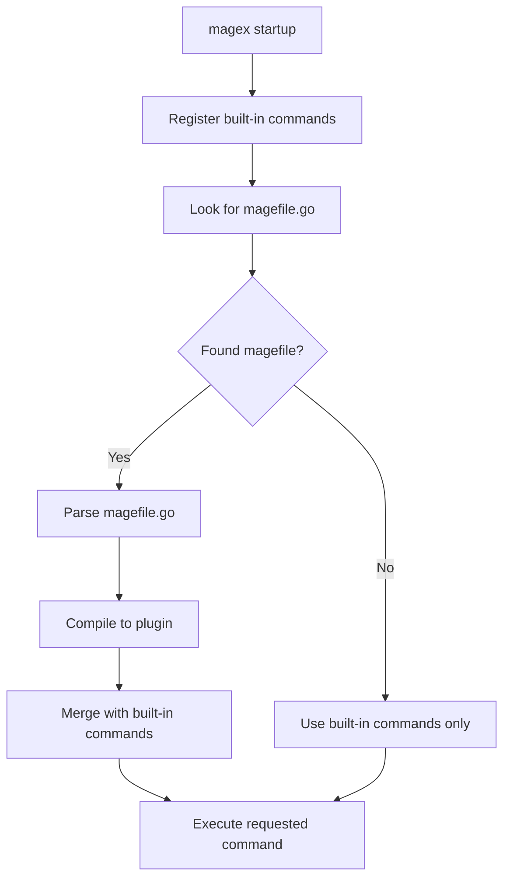

# 🚀 MAGE-X Binary (magex) - Complete Guide

> **magex**: The hybrid binary+library that brings true "Write Once, Mage Everywhere" to Go build automation

## 🎯 Overview

The `magex` binary is MAGE-X's revolutionary hybrid approach that provides **true zero-boilerplate** build automation. It includes all 215+ MAGE-X commands built-in while maintaining full compatibility with existing magefiles.

### ✨ Key Features

- **🎉 Zero Configuration**: All commands work immediately without any setup
- **🔄 Drop-in Replacement**: Fully compatible with standard `mage` CLI
- **🚀 215+ Built-in Commands**: All MAGE-X namespaces embedded and ready
- **🎭 Hybrid Architecture**: Combines built-in commands with custom user commands
- **🧠 Intelligent Discovery**: Smart command discovery, search, and suggestions
- **📱 Beautiful UX**: Rich help system and user-friendly output

## 📦 Installation

### Quick Install
```bash
go install github.com/mrz1836/mage-x/cmd/magex@latest
```

### Verify Installation
```bash
magex -version
# Should show: MAGE-X version 1.0.0
```

### Alternative Methods

#### From Source
```bash
git clone https://github.com/mrz1836/mage-x.git
cd mage-x
go build -o magex ./cmd/magex
```

#### Docker
```bash
# Run in container
docker run --rm -v $(pwd):/workspace ghcr.io/mrz1836/magex:latest build

# Build Docker image locally
docker build -t magex .
```

## 🎮 Usage

### Basic Commands
```bash
magex -h                    # Show help
magex -l                    # List all commands
magex -n                    # Commands by namespace
magex -search <query>       # Search commands
magex -version              # Show version
magex -init                 # Create magefile template
magex -clean                # Clean cache
```

### Running Commands
```bash
magex build                 # Run build command
magex test                  # Run test command
magex lint:fix             # Run lint:fix command
magex build:linux          # Namespace:method syntax
```

### Command Discovery
```bash
# Find commands
magex -search test         # Find test-related commands
magex -search "multi"      # Find multi-platform commands

# Explore namespaces
magex -n                   # All namespaces
magex -l | grep build      # Filter for build commands
```

## 🏗️ Architecture

### Hybrid Binary + Library Design

```
magex binary
├── Built-in MAGE-X Commands (215+)
│   ├── build namespace (14 commands)
│   ├── test namespace (18 commands)
│   ├── lint namespace (7 commands)
│   └── ... (21 more namespaces)
└── Dynamic User Commands
    ├── Custom magefile.go loading
    ├── Plugin compilation
    └── Command merging
```

### Command Registry System

The `magex` binary uses a sophisticated command registry that:

1. **Pre-registers** all built-in MAGE-X commands on startup
2. **Discovers** user's magefile.go (if present)
3. **Compiles** user commands to plugins (when possible)
4. **Merges** built-in and user commands into unified registry
5. **Executes** commands through unified interface

### Execution Flow



## 📋 Command Reference

### Built-in Namespaces (24 total)

| Namespace | Commands | Description |
|-----------|----------|-------------|
| build | 14 | Building and compilation |
| test | 18 | Testing and coverage |
| lint | 7 | Code quality and linting |
| format | 6 | Code formatting |
| deps | 11 | Dependency management |
| git | 12 | Git operations |
| release | 21 | Release management |
| docs | 10 | Documentation |
| tools | 4 | Tool management |
| generate | 5 | Code generation |
| cli | 14 | CLI operations |
| update | 5 | Update operations |
| mod | 9 | Module operations |
| recipes | 7 | Recipe system |
| metrics | 6 | Metrics and analytics |
| workflow | 8 | Workflow management |
| bench | 8 | Benchmarking |
| vet | 5 | Go vet operations |
| configure | 8 | Configuration |
| init | 10 | Project initialization |
| enterprise | 8 | Enterprise features |
| integrations | 8 | Third-party integrations |
| wizard | 6 | Interactive wizards |
| help | 7 | Help system |

### Command Syntax

```bash
# Namespace commands
magex <namespace>:<method>
magex build:linux          # build namespace, linux method
magex test:unit            # test namespace, unit method

# Direct commands (aliases)
magex build                # Alias for build:default
magex test                 # Alias for test:default
magex lint                 # Alias for lint:default
```

## 🎛️ Configuration

### Global Configuration

Create `~/.magex/config.yaml`:

```yaml
# Global magex configuration
defaults:
  verbose: false
  parallel: true
  timeout: "5m"

# Command-specific defaults
build:
  output_dir: "./dist"
  binary_name: "app"

test:
  coverage: true
  race: true
  tags: ["unit", "integration"]

# Integrations
github:
  token: "${GITHUB_TOKEN}"

docker:
  registry: "ghcr.io"
```

### Project Configuration

Create `.magex.yaml` in your project:

```yaml
# Project-specific magex configuration
project:
  name: "my-awesome-app"
  version: "auto"  # Auto-detect from git

build:
  binary_name: "${project.name}"
  platforms: ["linux", "darwin", "windows"]
  output_dir: "./dist"

test:
  timeout: "10m"
  packages: ["./..."]

lint:
  enable: ["golint", "gofmt", "govet"]
  disable: ["unused"]
```

### Environment Variables

```bash
# Control magex behavior
export MAGEX_VERBOSE=true      # Enable verbose output
export MAGEX_DEBUG=true        # Enable debug output
export MAGEX_CONFIG_DIR=~/.magex  # Config directory
export MAGEX_CACHE_DIR=~/.magex/cache  # Cache directory

# Backwards compatibility with mage
export MAGE_VERBOSE=1          # Also enables verbose
export MAGE_DEBUG=1            # Also enables debug
```

## 🔧 Advanced Usage

### Custom Commands Integration

Create a `magefile.go` for project-specific commands:

```go
//go:build mage
package main

import (
    "fmt"
)

// Deploy deploys the application
func Deploy() error {
    fmt.Println("🚀 Deploying application...")
    // Custom deployment logic
    return nil
}

// Local development setup
func DevSetup() error {
    fmt.Println("🏗️ Setting up development environment...")
    // Custom setup logic
    return nil
}
```

Both built-in and custom commands are available:

```bash
magex build      # Built-in MAGE-X command
magex test       # Built-in MAGE-X command
magex deploy     # Your custom command
magex devsetup   # Your custom command
```

### Plugin System

The `magex` binary can dynamically load user commands via Go's plugin system:

1. **Parse** user's magefile.go using Go AST
2. **Discover** exported functions and types
3. **Compile** magefile to shared library plugin
4. **Load** plugin at runtime
5. **Register** discovered commands in registry

### Command Aliases

Built-in aliases for convenience:

```bash
# These are equivalent
magex build
magex build:default
magex build:build

# Search for aliases
magex -search alias
```

### Batch Operations

```bash
# Run multiple commands
magex build test lint

# Parallel execution
magex -parallel build test

# With timeout
magex -timeout 10m build
```

## 🚀 Performance

### Startup Performance

- **Cold start**: ~50ms (includes command registration)
- **Warm start**: ~20ms (with cache)
- **Command discovery**: ~10ms for 215+ commands
- **Memory usage**: ~15MB binary size

### Optimization Features

- **Lazy loading**: Commands loaded on-demand
- **Caching**: Compiled plugins cached
- **Parallel execution**: Multi-core utilization
- **Smart dependencies**: Automatic dependency resolution

### Benchmarks

```bash
# Run performance benchmarks
cd benchmarks
go test -bench=. -benchmem

# Binary startup benchmark
time magex -version

# Command execution benchmark
time magex help
```

## 🛠️ Development

### Building from Source

```bash
git clone https://github.com/mrz1836/mage-x.git
cd mage-x

# Build binary
go build -o magex ./cmd/magex

# Install locally
go install ./cmd/magex

# Cross-platform builds
GOOS=linux go build -o magex-linux ./cmd/magex
GOOS=windows go build -o magex.exe ./cmd/magex
```

### Testing

```bash
# Unit tests
go test ./cmd/magex/...

# Integration tests
go test ./tests/e2e/...

# Compatibility tests
go test ./tests/compatibility/...

# Benchmark tests
go test -bench=. ./benchmarks/...
```

### Contributing

1. **Fork** the repository
2. **Create** feature branch
3. **Add** tests for new functionality
4. **Update** documentation
5. **Submit** pull request

## 🔍 Troubleshooting

### Common Issues

#### Command Not Found
```bash
# Verify installation
which magex
magex -version

# Check PATH
echo $PATH

# Reinstall if needed
go install github.com/mrz1836/mage-x/cmd/magex@latest
```

#### Plugin Compilation Fails
```bash
# Check Go toolchain
go version

# Enable debug output
MAGEX_DEBUG=true magex -l

# Manual compilation test
go build -buildmode=plugin ./magefile.go
```

#### Permission Denied
```bash
# Check file permissions
ls -la $(which magex)

# Reinstall with proper permissions
sudo rm $(which magex)
go install github.com/mrz1836/mage-x/cmd/magex@latest
```

### Debug Output

```bash
# Enable verbose output
magex -v build

# Enable debug output
MAGEX_DEBUG=true magex build

# Trace command execution
MAGEX_VERBOSE=true MAGEX_DEBUG=true magex build
```

### Getting Help

- 📖 **Documentation**: [Full docs](../README.md)
- 🐛 **Issues**: [GitHub Issues](https://github.com/mrz1836/mage-x/issues)
- 💬 **Discussions**: [GitHub Discussions](https://github.com/mrz1836/mage-x/discussions)
- 🤝 **Contributing**: [Contributing Guide](../.github/CONTRIBUTING.md)

## 📈 Migration Guide

### From Standard Mage

1. **Install magex**: `go install github.com/mrz1836/mage-x/cmd/magex@latest`
2. **Replace commands**: Use `magex` instead of `mage`
3. **Remove boilerplate**: Delete wrapper functions from magefile.go
4. **Keep custom code**: Maintain only project-specific commands

### From MAGE-X Library

1. **Install binary**: `go install github.com/mrz1836/mage-x/cmd/magex@latest`
2. **Remove imports**: No more `_ "github.com/mrz1836/mage-x/pkg/mage"`
3. **Simplify magefile**: Keep only custom functions
4. **Use directly**: `magex build` instead of `mage build`

## 🎯 Best Practices

### Command Organization
- Use **built-in commands** for standard operations
- Create **custom commands** only for project-specific needs
- Follow **clear naming** conventions for custom commands
- **Document** custom commands with comments

### Performance
- Use **parallel execution** for independent operations
- Set appropriate **timeouts** for long-running commands
- **Cache** compiled plugins for faster startup
- **Profile** custom commands for optimization

### Security
- **Validate inputs** in custom commands
- Use **environment variables** for sensitive data
- **Audit** magefile.go for security issues
- Keep **dependencies updated**

## 🔮 Future Enhancements

### Planned Features
- **Tab completion** for shells (bash, zsh, fish)
- **Update notifications** for new releases
- **Command history** and favorites
- **Interactive mode** with command prompt
- **Remote command execution**
- **Plugin marketplace**

### Experimental Features
- **AI-powered command suggestions**
- **Workflow templates**
- **Visual command builder**
- **Cloud integration**

---

**Ready to experience true zero-boilerplate build automation?**

```bash
go install github.com/mrz1836/mage-x/cmd/magex@latest
cd your-project
magex build  # It just works! 🚀
```
