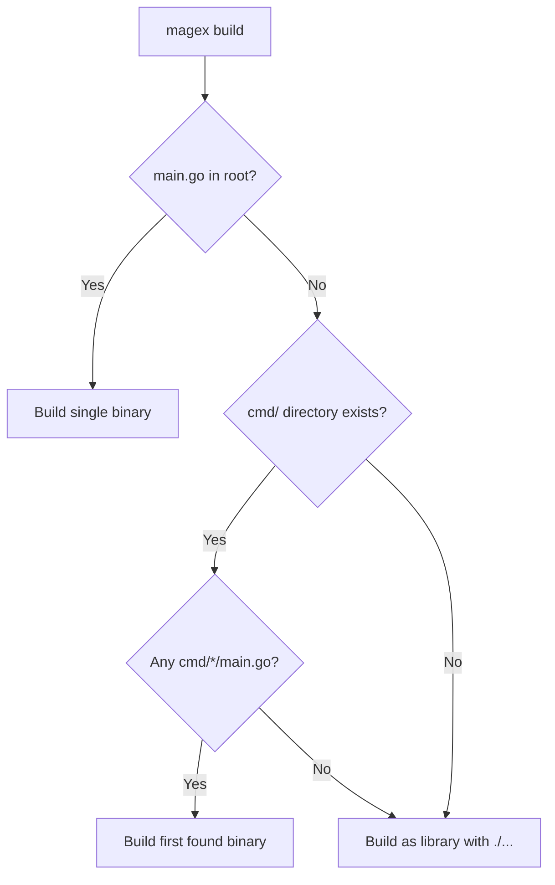

# 🚀 MAGE-X Quick Start Guide

> **MAGE-X**: Write Once, Mage Everywhere - True Zero-Boilerplate Build Automation

## 🎯 How MAGE-X Detects Your Project

MAGE-X automatically identifies your Go project structure and applies the right build strategy - **no configuration needed!**

### Project Detection Logic



### Common Project Structures

| Structure         | Detection            | Build Output           | Example Projects                |
|-------------------|----------------------|------------------------|---------------------------------|
| **Single Binary** | `main.go` in root    | `bin/{project-name}`   | CLI tools, simple services      |
| **Multi-Binary**  | `cmd/{name}/main.go` | `bin/{name}`           | go-pre-commit, kubernetes tools |
| **Library Only**  | No main packages     | Compilation check only | SDK packages, shared libs       |

## The New Way: Zero Configuration! 🎉

MAGE-X now provides **true zero-boilerplate** automation through the `magex` binary. No more wrapper functions or complex setup!

### ⚡ Installation & Setup

```bash
# Step 1: Install magex binary
go install github.com/mrz1836/mage-x/cmd/magex@latest

# Step 2: Auto-update to latest stable release (with proper version info)
magex update:install

# Step 3: Use immediately in ANY Go project!
cd your-go-project
magex build         # Automatically detects & builds your project
magex test          # Run tests
magex lint:fix      # Fix linting issues
magex release:multi # Multi-platform release

# That's it! No magefile.go needed! 🚀
```

> 💡 **Why the update step?** The `go install` command doesn't embed version information in the binary, so you get a "dev" version. Running `magex update:install` downloads the latest pre-built release with proper version info embedded. After step 2, `magex --version` will show the correct version instead of "dev".

### 🔧 Troubleshooting Installation

**Problem:** `magex --version` shows "dev"
**Solution:** Run `magex update:install` to get the properly versioned binary

**Problem:** `magex update:check` says the latest version but binary shows "dev"
**Solution:** This is expected behavior - the update check reads git tags, not binary version. Run `magex update:install` to fix.

**Problem:** Want to ensure you have the absolute latest release
**Solution:**
```bash
magex update:check    # Check what's available
magex update:install  # Install latest release
magex --version       # Verify version
```

### 📋 See What's Available

```bash
magex -l            # List all 215+ commands
magex -n            # Commands organized by namespace
magex -search test  # Find specific commands
magex -h            # Get help
```

### 🔍 Command Examples

```bash
# Building
magex build                 # Build for current platform
magex build:linux           # Build for Linux
magex build:multiplatform   # Build for all platforms

# Testing
magex test                  # Run all tests
magex test:unit             # Run unit tests only
magex test:integration      # Run integration tests
magex test:coverage         # Generate coverage reports

# Linting & Quality
magex lint                 # Run linter
magex lint:fix             # Auto-fix linting issues
magex format               # Format code
magex vet                  # Run go vet

# Dependencies
magex deps:update         # Update dependencies
magex deps:audit          # Security audit
magex mod:tidy            # Clean up go.mod

# Release Management
magex release:patch       # Create patch release
magex release:minor       # Create minor release
magex release:major       # Create major release
```

## Optional: Custom Commands

Only create a `magefile.go` if you need **project-specific** commands:

### 1. Initialize Custom Magefile

```bash
magex -init              # Creates magefile.go template
```

### 2. Add Your Custom Commands

```go
//go:build mage
package main

// Deploy deploys your application (custom command)
func Deploy() error {
    // Your custom deployment logic
    fmt.Println("Deploying application...")
    return nil
}

// Custom build with special flags
func BuildSpecial() error {
    // Custom build logic
    return nil
}
```

### 3. Use Both Built-in and Custom Commands

```bash
magex build         # Built-in MAGE-X command
magex test          # Built-in MAGE-X command
magex deploy        # Your custom command
magex buildspecial  # Your custom command
```

## 📂 Project Structure Examples

### Zero-Config Project (Single Binary)
```
my-go-project/
├── go.mod
├── go.sum
├── main.go            # ← MAGE-X detects this
└── pkg/
    └── ...
```
✅ **Works immediately:** `magex build` → creates `bin/my-go-project`

### Multi-Binary Project (Auto-Detected)
```
go-pre-commit/         # Real example!
├── go.mod
├── go.sum
├── cmd/
│   ├── go-pre-commit/
│   │   └── main.go    # ← MAGE-X finds this
│   └── production-validation/
│       └── main.go    # ← Or this
├── internal/
│   └── ...
└── pkg/
    └── ...
```
✅ **Works immediately:** `magex build` → creates `bin/go-pre-commit`

### Library Project (No Binaries)
```
my-sdk/
├── go.mod
├── go.sum
├── client.go          # No main package
├── api/
│   └── types.go
└── pkg/
    └── utils/
        └── helpers.go
```
✅ **Works immediately:** `magex build` → verifies compilation with `./...`

### With Custom Commands
```
my-go-project/
├── go.mod
├── go.sum
├── main.go
├── magefile.go        # Only if you need custom commands
└── pkg/
    └── ...
```
⚠️ **Only add magefile.go for project-specific commands not in MAGE-X**

## 🏗️ Real-World Examples

### New Go CLI Project
```bash
mkdir my-cli
cd my-cli
go mod init github.com/user/my-cli

# Create main.go
cat > main.go << EOF
package main

import "fmt"

func main() {
    fmt.Println("Hello, CLI!")
}
EOF

# Build and test immediately!
magex build
magex test
magex lint
```

### Multi-Binary Project Setup
```bash
mkdir my-tools
cd my-tools
go mod init github.com/user/my-tools

# Create main tool
mkdir -p cmd/my-tool
cat > cmd/my-tool/main.go << EOF
package main

import "fmt"

func main() {
    fmt.Println("Main tool running!")
}
EOF

# Create helper tool
mkdir -p cmd/helper
cat > cmd/helper/main.go << EOF
package main

import "fmt"

func main() {
    fmt.Println("Helper tool running!")
}
EOF

# MAGE-X automatically detects the first main package found!
magex build        # Builds cmd/helper or cmd/my-tool (first found alphabetically)
magex test         # Tests all packages
magex build:all    # Builds for all platforms
```

## 🔧 Troubleshooting

### Multi-Binary Projects (like go-pre-commit)

**Problem:** "no main package found for binary build"

**Solution:** Ensure you have the latest version of magex:
```bash
# Update to latest version
go install github.com/mrz1836/mage-x/cmd/magex@latest

# Verify it detects your structure
cd your-project
magex build  # Should auto-detect cmd/*/main.go
```

**How it works:** MAGE-X scans for main packages in this order:
1. `main.go` in project root
2. `cmd/magex/main.go` (for MAGE-X itself)
3. `cmd/*/main.go` (any subdirectory in cmd/)
4. Falls back to library mode if no main package found

**For multiple binaries:** If you have multiple binaries (e.g., `cmd/app/` and `cmd/cli/`):
- MAGE-X builds the first one found alphabetically by default
- Use `.mage.yaml` to specify which binary to build:

```yaml
# .mage.yaml for multi-binary projects
project:
  name: my-project
  binary: app  # Specify default binary name

build:
  output: bin
  # Optionally specify exact path
  # main_path: ./cmd/app
```

### Build Detection Issues

**Quick diagnosis:**
```bash
# Check what MAGE-X sees in your project
ls -la main.go 2>/dev/null || echo "No main.go in root"
ls -la cmd/*/main.go 2>/dev/null || echo "No cmd/*/main.go found"

# Verify magex version
magex -version
```

### Existing Project Migration
```bash
cd existing-project

# No changes needed! Just start using magex
magex build         # Works immediately
magex test          # Works immediately

# Optional: Remove old Mage wrapper functions from magefile.go
# Keep only your project-specific custom commands
```

## 🆚 Migration from Traditional Mage

### Before (Traditional Mage)
```go
//go:build mage
package main

import (
    "github.com/mrz1836/mage-x/pkg/mage"
)

// Build wrapper function (boilerplate!)
func Build() error {
    b := mage.NewBuildNamespace()
    return b.Build()
}

// Test wrapper function (boilerplate!)
func Test() error {
    t := mage.NewTestNamespace()
    return t.Test()
}

// 90+ more wrapper functions... 😓
```

### After (MAGE-X with magex)
```bash
# No magefile.go needed!
magex build    # Just works!
magex test     # Just works!
```

**Or** with custom commands:
```go
//go:build mage
package main

// Keep only YOUR custom commands!
func Deploy() error {
    // Your project-specific logic
    return nil
}
```

## 🎛️ Advanced Configuration

### Project-Specific Configuration
Create `.mage.yaml` or `.magex.yaml` for project-specific settings:

```yaml
# .mage.yaml (recommended for MAGE-X projects)
project:
  name: my-app
  binary: my-app

build:
  output: bin
  go_version: "1.24"
  platforms:
    - linux/amd64
    - darwin/amd64
    - windows/amd64

test:
  timeout: 300
  coverage: true
  race: true
```

For **multi-binary projects**, MAGE-X automatically detects the first main package in `cmd/` subdirectories. To specify which binary to build by default, configure the binary name:

```yaml
# .mage.yaml for multi-binary project
project:
  name: my-tools
  binary: primary-tool  # Builds cmd/primary-tool by default

build:
  output: bin
```

### Global Configuration
Configure magex globally in `~/.magex/config.yaml`:

```yaml
# ~/.magex/config.yaml
defaults:
  verbose: true
  parallel: true

integrations:
  github:
    token: "${GITHUB_TOKEN}"
```

## 📖 Next Steps

1. **Explore Commands**: `magex -l` to see all available commands
2. **Namespace Deep-Dive**: `magex -n` to see commands by category
3. **Search & Discovery**: `magex -search <term>` to find specific commands
4. **Advanced Features**: Check out [enterprise features](ENTERPRISE.md)
5. **Customization**: Learn about [configuration options](CONFIGURATION.md)

## 🚀 Pro Tips

- **Aliases**: Use `alias mx=magex` for shorter commands
- **Discovery**: Use `magex -search` to find exactly what you need
- **Help**: Every command has help: `magex help <command>`
- **Parallel**: Most commands support parallel execution automatically
- **CI/CD**: Use `magex` in GitHub Actions, Jenkins, etc.

## ❓ Need Help?

- 📚 [Full Documentation](../README.md)
- 🏗️ [Architecture Guide](NAMESPACE_INTERFACES.md)
- 🏢 [Enterprise Features](ENTERPRISE.md)
- 🤖 [AI Agent System](SUB_AGENTS.md)
- 💬 [GitHub Issues](https://github.com/mrz1836/mage-x/issues)
